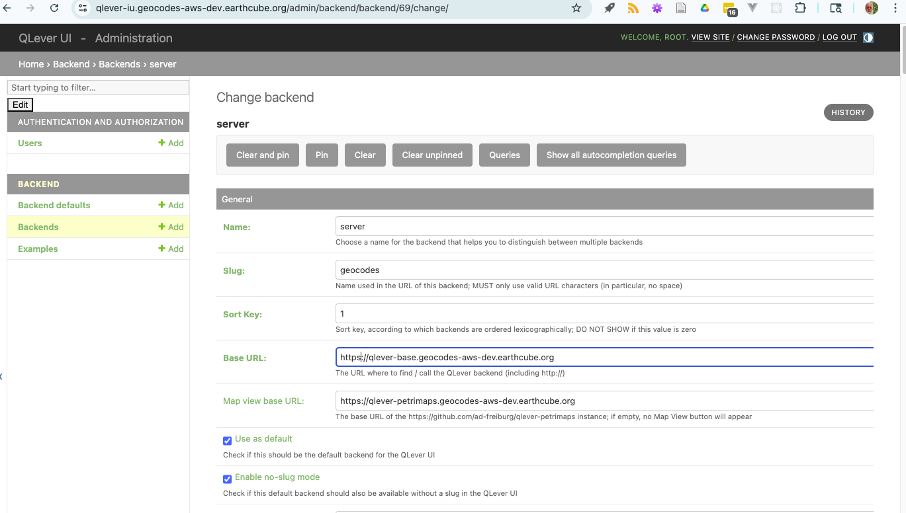

# Deployment for Portainer.

## **Local, see below**

# Three containers run:
* qlever-base.{HOST}
* qlever-ui.{HOST}
* qlever-petrimaps.{HOST}

use the qlever_services.yml for now.

Deploy with cut and paste for now.


| Variable      | default          | note                                                                 |
|---------------|------------------|----------------------------------------------------------------------|
| HOST          | the host,        | eg geocodes-aws-dev.earthcube.org                                    |
| PROJECT       | geocodesexamples | the namespace in catalogues and for objects in portainer and traefik |
| PREFIX        | data             | catalogues/PREFIX-PROJECT                                            |
| QLEVER_CONFIG | geocodesexamples | name of the docker config                                            | 
| QLEVER_NET    | base             | base namespace for that the qlevels might talk over                  |
| QLEVER_VOL    | main             |  namespace for UI configuration volume |

# CONFIGURING THE UI
* initially the UI admin
* log into console in portainer/docker
* `python manage.py makemigrations --merge && python manage.py migrate`
* `./manage.py createsuperuser`
   * note this can be automated... 
* then go to the UI admin page in web browser: https://qlever-iu.geocodes-aws-dev.earthcube.org/admin
  * add the url, with the full path, since users will be using this.
  `https://qlever-base.geocodes-aws-dev.earthcube.org`
  * be ure that the Sort Key is NOT ZERO
  * map base (needs to be tested):
  `https://qlever-petrimaps.geocodes-aws-dev.earthcube.org`
  
 

## Run an additional container using qlever_namespace.yaml
additional containers can be run in portainer by adding an additional stack using `qlever_namespace.yaml`
You will need to add a superuser to the UI and manually add a backend in the https://qlever-iu.SERVER/admin

```
QLEVER_NET=base
PROJECT=deepoceans
PREFIX=data
HOST=geocodes-aws-dev.earthcube.org
QLEVER_CONFIG=deepoceans
QLEVER_VOL=main
```

## LOCAL
run with qlever_services_override.yaml, 

### this will run with default properties, eg catalogues/data-geocodesdemo 

`cd deployment; /usr/local/bin/docker compose -f ./qlever_services.yaml -f ./qlever_services_override.yaml -p deployment up 
`
[UI on 8176](http://localhost:8176/)

### Run dev
this will run the catalogues/dev-multifile
```bash
export PROJECT=multifile
export PREFIX=dev
/usr/local/bin/docker compose -f ./qlever_services.yaml -f ./qlever_services_override.yaml -p deployment up 
```

[UI on 8176](http://localhost:8176/)

### local data
#### QLEVER Server
you can look at the local index files in deployment/rundata
When containers are stopped, you  can clean up all files but the .gitkeep, 
#### QLEVER UI
The data is on the docker volume: qleverflow_data_PROJECT

Quirks:
* catalogues/local/Qleverfile-ui-deploy.yml uses port 7019, because that is what is used in the geeocodes demo and deepoceans ports
* when running with the `-f ./qlever_services_override.yaml` you can't have the network treafik_proxy and qlever-network-base defined externally


### TESTING MULTIPLE LOCALLY
Run a services stack, and a namespace stack with overrides

```
QLEVER_NET=base
PROJECT=multifile
PREFIX=dev
QLEVER_CONFIG=multifile
QLEVER_VOL=main
```
`cd deployment; /usr/local/bin/docker compose -f ./qlever_services.yaml -f ./qlever_services_override.yaml -p deployment up 
`
got to 
[UI on 8176](http://localhost:8176/)


```
QLEVER_NET=base
PROJECT=deepoceans
PREFIX=data
QLEVER_CONFIG=deepoceans
QLEVER_VOL=main
```

`cd deployment; /usr/local/bin/docker compose -f ./qlever_namespace.yaml -f ./qlever__namespace_override.yaml -p deployment up 
`

## TROUBLESHOOTING LOCAL
there is a deployment/rundata. when docker is not running the stack, remove all but the .gitkeep files
